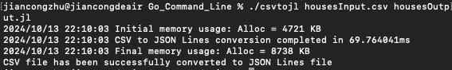

# CSV to JSON Lines Converter

This is a Go command-line application that converts data from a CSV file to a JSON Lines (JSONL) file format. JSON Lines is a convenient format for storing structured data that is easy to process and parse, commonly used for streaming applications, databases, and document stores.

## Overview

The application reads data from a CSV file, where the first row represents the headers, and subsequent rows represent the data entries. The program then converts each row of data into a JSON object and writes these objects into an output file, one JSON object per line.

### Roles of Programs and Data

- **Go Application**: The main program (`csvtojl`) reads the CSV file, converts each row to JSON format, and writes it to an output JSONL file.
- **Input Data (CSV)**: The CSV file (`housesInput.csv`) contains the data to be converted, with headers defining the keys for each JSON object.
- **Output Data (JSONL)**: The output file (`housesOutput.jl`) contains each row from the CSV file in JSON format, separated by newlines.

## Requirements

- [Go](https://golang.org/doc/install) version 1.16 or above.

## Usage Instructions

### Step 1: Clone the Repository

First, clone the repository containing this program to your local machine:

```sh
git clone https://github.com/Kevin-jc-github/Go_Command_Line.git
cd Go_Command_Line
```

### Step 2: Prepare Input Data

Ensure that your CSV file (`housesInput.csv`) is placed in the root of the project directory. The CSV file must have:

- A header row, which defines the column names (used as JSON keys).
- Data rows, which represent the actual data values.

Example CSV (`housesInput.csv`):

```csv
value,income,age,rooms,bedrooms,pop,hh
452600,8.3252,41,880,129,322,126
358500,8.3014,21,7099,1106,2401,1138
```

### Step 3: Build the Program

To compile the program, use the following command to build it:

```sh
go build -o csvtojl
```

### Step 4: Create an Executable File for Your OS

For Windows: To create a .exe file that can be executed on Windows, use the following command:
```sh
GOOS=windows GOARCH=amd64 go build -o csvtojl.exe
```
For MacOS: To create an .app file for MacOS, use the following command:
```sh
GOOS=darwin GOARCH=amd64 go build -o csvtojl.app
```
These commands set the target operating system and architecture, allowing you to build platform-specific executable files.

This command creates an executable file named `csvtojl` in the current directory.

### Step 5: Run the Application

To run the program and convert a CSV file to a JSON Lines file, use the following command:

```sh
./csvtojl housesInput.csv housesOutput.jl
```

This command takes two arguments:

1. **Input CSV file**: The path to the CSV file to be read (`housesInput.csv`).
2. **Output JSON Lines file**: The path to the JSONL file to be written (`housesOutput.jl`).

If the command runs successfully, it will output:

```
CSV file has been successfully converted to JSON Lines file
```

The output JSON Lines file (`housesOutput.jl`) will contain each row of data in JSON format, written one per line.

### Example JSON Lines Output (`housesOutput.jl`):

```json
{"age":"41","bedrooms":"129","hh":"126","income":"8.3252","pop":"322","rooms":"880","value":"452600"}
{"age":"21","bedrooms":"1106","hh":"1138","income":"8.3014","pop":"2401","rooms":"7099","value":"358500"}
```

## Unit Test


## Performance and Profiling

This application also includes CPU profiling, memory monitoring, and performance benchmarking to ensure efficient operation and help identify bottlenecks.

### Features Added for Profiling and Monitoring

1. **CPU Profiling**: The program uses Go's `pprof` package to generate a CPU profile (`cpu.prof`). This helps in analyzing how the CPU is used during the execution of the program, which is useful for identifying performance issues.

2. **Memory Monitoring**: Memory usage statistics are captured before and after processing the CSV file using `runtime.MemStats`. This allows monitoring of memory allocation and helps ensure that memory is being used efficiently throughout the program.

3. **Performance Timing**: The program records the start and end times of the conversion process to calculate the total duration. This provides a performance benchmark, indicating how long it takes to convert the CSV to JSON Lines format.

4. **Program Logging**: Logs are generated throughout the program to provide feedback on the progress and potential errors. These logs can be useful for debugging and understanding the program flow.

### How to Use Profiling

- **CPU Profiling**: When running the program, it generates a file called `cpu.prof` in the current directory. You can use the following command to analyze the profile:

  ```sh
  go tool pprof cpu.prof
  ```

  This will help you visualize the CPU usage and identify any functions that consume excessive CPU resources.

- **Memory Monitoring**: Memory statistics are logged before and after the CSV processing. These logs will indicate the amount of memory allocated and help track memory usage trends.

### Example Performance Logs

- **Memory Usage**:
  ```
  2024/10/13 22:10:03 Initial memory usage: Alloc = 4721 KB
  2024/10/13 22:10:03 CSV to JSON Lines conversion completed in 69.764041ms
  2024/10/13 22:10:03 Final memory usage: Alloc = 8738 KB
  ```

- **Execution Time**:
  ```
  CSV to JSON Lines conversion completed in 69.764041ms.
  ```
  


These features were added to fulfill the requirement of monitoring processing requirements, generating program logs and profiles, and ensuring the program's efficiency. Future additions may include unit tests for critical components and a Monte Carlo performance benchmark if required.

### Example Scenarios:

- **Valid CSV File**: If your CSV file is well-formatted, the program will convert it to JSON Lines format and display a success message.
- **Invalid File Paths**: If an invalid file path is provided, the program will log an error message and exit.

## Conclusion

This application is designed to simplify the process of converting structured CSV data to JSON Lines format, making it easy to handle large datasets for downstream applications. By following the steps above, you should be able to successfully run and test this command-line utility. If you encounter any issues or have questions, feel free to consult Go documentation or ask for help.

